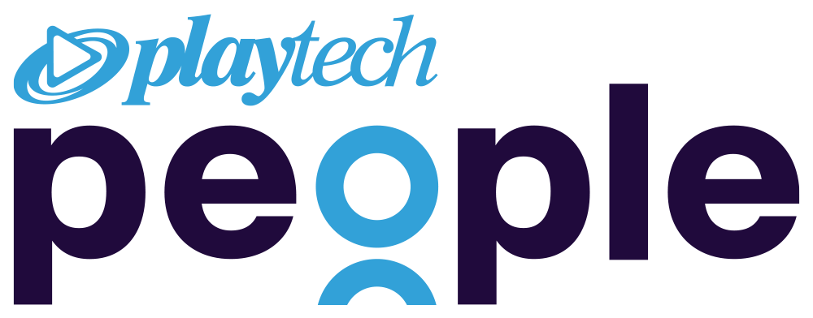
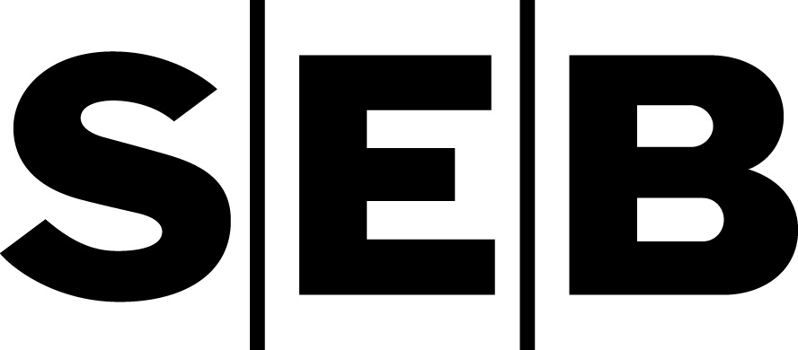

# Scholarship

Updated: June 1, 2026 7:13 AM

<aside>
🤓 **Do you want to receive financial support from //kood? This page includes all you need to know about the scholarships available at //kood. So dive right in!**

</aside>

By providing financial support, we want to create an environment where students can thrive educationally and reach their full potential. We also recognise at //kood that financial difficulties can pose significant barriers to educational success, and our goal is to assist students facing economic challenges. 

**Next deadline to fill in the [scholarship application form](https://forms.gle/xDRX2jbRXK2tvxNh6) is on June 15th 2026, 23:59.** Applying for the Scholarship will start on **1st of June 2026.**

- **1. TERMS AND CONDITIONS**
    
    1.1. A //kood Scholarship is a benefit targeted into the future and paid for fostering the acquisition of knowledge or skills, development of abilities and creative or scientific activities.
    
    1.2. A student can apply for a //kood Scholarship if:
    
    1.2.1. they are an Estonian citizen or reside in Estonia under a long-term or  temporary residence permit or a permanent or temporary right of residence;
    
    1.2.2. they are studying full-time, have study results higher than the Batch's average and fulfill all the curriculum requirements (incl. deadlines). Batch’s average will be fixed at the end of application period;
    
    1.2.3. they have maintain constructive participation, supported by positive feedback from other students;
    
    1.2.4. they are not on study leave.
    
    1.2. The student has the right to apply for the Scholarship twice during the study period:
    
    1.2.1. in December (for January, February, March, April, May and June);
    
    1.2.2. in June (for July, August, September, October, November and December).
    
- **2. APPLICATION EVALUATION AND SELECTION PROCESS**
    
    2.1. To apply for the scholarship, students must fill in the application form provided by the //kood team.
    
    2.2. The student submits the application form by December 15th or June 15th. Applications must be submitted before the deadline.
    
    2.2.1. The application form includes a motivational video (max 3 minutes).
    
    2.3. Students are encouraged, though not obligated, to contribute voluntarily to the activities of //kood during the scholarship period (for example, mentoring new students, testing tasks, giving feedback, representing the school at various events, etc).
    
    2.4. The Scholarship applications will be evaluated, and recipients will be selected by the //kood committee within 10 days.
    
    2.4.1. The decision-making process involves a comprehensive review of each application, considering factors such as study performance, the motivation, contribution to the activities of //kood and the quality of the motivational video.
    
    2.4.2. The selection process aims to identify students who demonstrate both study excellence and a commitment to their studies and personal development.
    
- **3. AMOUNT, DURATION AND PAYMENTS OF THE SCHOLARSHIP**
    
    3.1. The amount of the Scholarship is 150 EUR per month (net).
    
    3.2. The amount of the Scholarship is payable every month for 6 months.
    
    3.3. The Scholarship will be transferred on the 10th date of the month after the Scholarship was achieved.
    
- **4. TERMINATION OF THE SCHOLARSHIP**
    
    4.1. //kood may extraordinarily terminate the Scholarship if:
    
    4.1.1. If the Student terminates the Student Agreement or is dismissed from their studies;
    
    4.1.2. If the Student engages in behaviour that violates the school's [Code of Conduct](https://www.notion.so/3c13c03c51724387b1373970ece74d7d?pvs=21);
    
    4.1.3. If the Student does not meet the deadlines and fails to maintain study results higher than the Batch's average;
    
    4.1.4. If the Student takes study leave.
    

For further inquiries or clarification regarding scholarships, please contact **students@kood.tech**

<aside>

       **5 scholarships in the period of July 2026 - December 2026 are covered by**

</aside>

<aside>

       **10 scholarships in the period of January 2026 - June 2026 are covered by**

</aside>